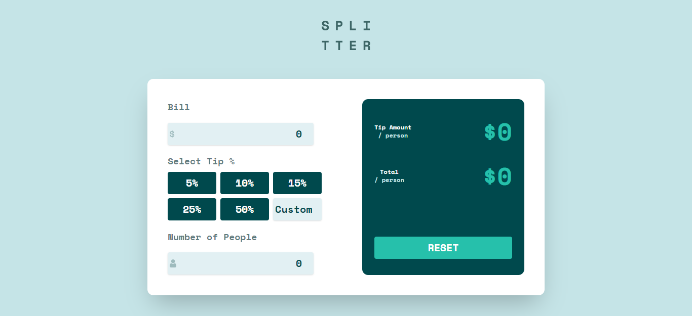

# Frontend Mentor - Tip calculator app solution

This is a solution to the [Tip calculator app challenge on Frontend Mentor](https://www.frontendmentor.io/challenges/tip-calculator-app-ugJNGbJUX). Frontend Mentor challenges help you improve your coding skills by building realistic projects.

## Table of contents

- [Overview](#overview)
  - [The challenge](#the-challenge)
  - [Screenshot](#screenshot)
  - [Links](#links)
- [My process](#my-process)
  - [Built with](#built-with)
  - [What I learned](#what-i-learned)

## Overview

### The challenge

Users should be able to:

- View the optimal layout for the app depending on their device's screen size
- See hover states for all interactive elements on the page
- Calculate the correct tip and total cost of the bill per person

### Screenshot

### Links

- Solution URL: [link](https://your-solution-url.com)
- Live Site URL: [link](https://your-live-site-url.com)

## My process

### Built with

- Semantic HTML5 markup
- [Tailwind CSS](https://tailwindcss.com/docs/guides/vite) - For styles
- [React](https://reactjs.org/) - JS library
- [Redux](https://redux.js.org/) - React state management
- [TypeScript](https://www.typescriptlang.org/)
- [Vite JS](https://vitejs.dev/) - For frontend tooling

### What I learned

I learned how to use TypeScript in React JS and how to manage states using Redux.
